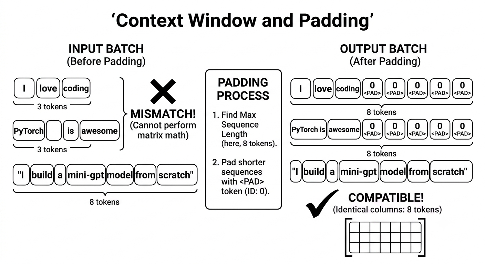

# Phase V: NLP(Natural Language Proccessing) Foundations

We are shifting our focus from spatial color pixels to temporal human language. Our goal here is to master how raw text strings are broken down, categorized, and converted into continuous mathematical representations that your future mini-model can digest.

We will learn how AI reads, processes, and structures textual data before feeding it into a sequence model.

## Tokenization and Vocabulary Building

An AI cannot read text raw. It has no concept of what the character "A" or "I" means.

To process language, we build a Vocabulary: a structural dictionary where every single unique word from our training data is isolated and mapped to a unique counting integer.

``` Raw Text: "I love AI"  ──>  Tokenized: ["i", "love", "ai"]  ──>  Numericalized: [1, 2, 3] ```

In production systems, we use special reserved tokens to handle system behaviors. The most critical one is the Padding Token (`<PAD>`), which we usually assign to index 0.

## The Context Window & Padding

Neural networks perform matrix math. To perform matrix operations over a batch of data, the incoming matrices must have matching dimensions.

If you feed two sentences into an LLM simultaneously:

1. "I love coding" (3 tokens)

2. "PyTorch is awesome" (3 tokens)

3. "I build a mini-gpt model from scratch" (8 tokens)

The third sentence forces a mismatch. To resolve this, we find the maximum length in our dataset (our mini context window) and pad the shorter sequences with our `<PAD>` token (0) until all rows have an identical column count.



## PyTorch Embeddings: Converting IDs to Semantic Vectors

Once a sentence becomes a uniform row of integer IDs like `[1, 2, 3, 0]`, we pass it to a `torch.nn.Embedding` layer.

Think of an embedding layer as a trainable lookup table. If our vocabulary size is 10 and we want an embedding dimension of 8, the embedding layer manages a (10, 8) matrix of floating-point numbers. When the index 1 passes through, it acts like an index lookup, grabbing the 8-dimensional vector representing that specific word.

During training, the values inside these vectors adjust so that words with similar contexts (like "coding" and "software") migrate closer together in geometric space.

1. The Core Concept: A Digital Dictionary

    Computers cannot understand the word "coding" or the number 3 as a concept. They need a list of features.

    An embedding layer is literally just a matrix (a grid of numbers) where every row belongs to one specific token in your vocabulary.

    - If your vocabulary size is 10, your grid has 10 rows.

    - If your embedding dimension is 8, each row contains 8 floating-point numbers.

2. The Mechanics: An Instant Lookup

    When your padded sequence `[1, 2, 3, 0]` passes into the embedding layer, no complex math happens yet. It is a simple indexing operation:

    - `1` $\rightarrow$ Go to Row 1 $\rightarrow$ Retrieve its 8 numbers (e.g., `[0.12, -0.4, ..., 0.81]`)

    - `2` $\rightarrow$ Go to Row 2 $\rightarrow$ Retrieve its 8 numbers

    - `3` $\rightarrow$ Go to Row 3 $\rightarrow$ Retrieve its 8 numbers

    - `0` $\rightarrow$ Go to Row 0 $\rightarrow$ Retrieve the <PAD> vector (usually just all zeros)

    Your input of 4 integers instantly transforms into a matrix of dimensions $(4, 8)$ (4 tokens, each represented by 8 numbers).

3. How "Meaning" is Learned (Semantic Migration)

    When you first initialize torch.nn.Embedding(10, 8), PyTorch fills the entire grid with completely random numbers. At first, the vector for "coding" and the vector for "software" look entirely different and point in random geometric directions.

    During training:

    - The model processes a sentence like "I love coding" and tries to predict the next word.

    - If it gets it wrong, the loss function calculates the error.

    - Backpropagation trickles backward and slightly adjusts those 8 numbers for "coding".

    Over millions of examples, because "coding" and "software" appear in similar contexts (surrounded by words like "program", "developer", "bug"), their mathematical updates look almost identical. As a result, their 8-dimensional coordinates migrate closer together in vector space.