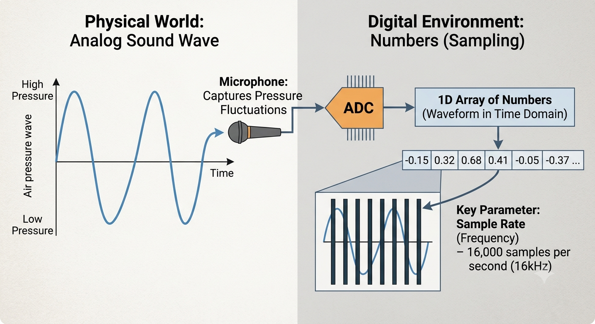

# Welcode to phase VI Speech & Audio

Before the era of modern end-to-end multimodal models, Audio was consider one of the hardest data types to process. So understanding audi processing  and signal analysis will giver you the foundational tool needed to later handle automatic speech recognition (ASR) and text-to-speech (TTS) framework.

## Audio Processing: What is Sound to a computer

In the physical world, sound travels as an analog continuous wave of air pressure. To get this into a digital environment, a microphone captures these pressure fluctuations and converts them into numbers vai a precess called sampling.

Key parameters you must master:

- **Simple Rate (Frequency):** How many times per second your computer records the audio amplitude. This is measured in Hertz (Hz). For standard speech models, 16000 Hz (16kHz or 16,000 numbers per second) is the absolute industry gold standard.

- **Waveform (Time Domain):** A 1D array of numbers where each  value represent the air pressure intensity at a exact millisecond in time.

## Signal Analysis: Moving to the Frequency Domain

While a raw 1D waveform tensor is perfect for a speaker to play back, it is incredibily noisy and difficult for an AI model to read directly. An LLM look for structural patterns, but raw waveform is just a series of rapid spikes.

To solve this, we convert the audio from Time Domain to the frequency Domain using a mathematical operation called the Fast Fourier Transform (FFt).

- **The Core Concept:** Instead of asking "What is the volume at millisecond 50?", signal analysis asks: "What frequencies (bass, mid-range, treble) are present during this split second of speech?"

- **The Spectrogram (2D Tensors):** By sliding a short window across the entire audio file and applying an FFT repeatedly (called Short-Time Fourier Transform or STFT), we map audio into a 2D image-like grid!.

    - Y-Axis: Frequencies (Pitch)

    - X-Axis: Time

    - Color Intensity: Energy/Volume of that frequency

> **NOTED:** By transforming a 1D audio wave into a 2D Spectrogram image, you can process audio using the exact same patch-slicing logic we built in Phase IV (Computer Vision) before feeding it straight into your Mini-GPT context window! This is exactly how modern speech-to-text models function under the hood.

